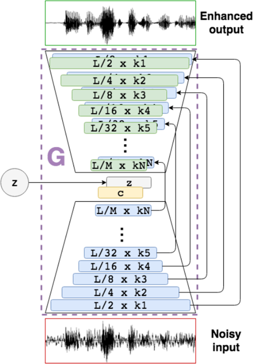

# SEGAN 
# SE-GAN
# Speech Enhancement GAN
# Speech Enhancement Generative Adversarial Network

### Pretrained Model
Old SEGAN generator weights are released and can be downloaded in [this link](http://veu.talp.cat/seganp/release_weights/segan+_generator.ckpt).
Make sure you place this file into the `ckpt_segan` directory to make it work with the proper `train.opts` config file within that folder. 
The script `run_segan_clean.sh` will properly read the ckpt in that directory as it is configured to be used with this referenced file.

### Introduction to old Segan
Old SEGAN uses skip connections between narrower and expander layers to ensure data won't mix up while training.
WaveGAN has this issue while denoising mean while it is not designed with this intention. Loss function is LSGAN




### Introduction to New Segan
New SEGAN is an improved version of SEGAN [1]. New SEGAN has a skip connections between narrower and expander layers. 
Also there is residual skip connections to upper layers of expander. There is two method to combine skip connections;
#####['summation' and 'concatenate']
Narrower and expander skip connections combines and connects to upper expander layer.

Loss function is LSGAN. Loss function doesn't change while skip connections


### Introduction to scripts
Three models are ready to train and use to make wav2wav speech enhancement conversions.
Denoising utterances with its generator network (G). <br/>
<b>Note: Determine batch size according to the memory size.</b>
  
To train this model, the following command should be ran:

```
python train.py --save_path ckpt_segan+ --batch_size 300 \
		--clean_trainset data/clean_trainset \
		--noisy_trainset data/noisy_trainset \
		--cache_dir data/cache
```

Read `run_new_segan_train.sh` for more guidance.
This will use the default parameters to structure both G and D, but they can be tunned with many options.
For example, one can play with `--d_pretrained_ckpt` and/or `--g_pretrained_ckpt` to specify a departure pre-train checkpoint to fine-tune some characteristics of our enhancement system, like language, as in [2].

Cleaning files is done by specifying the generator weights checkpoint, its config file from training and appropriate paths for input and output files (Use `soundfile` wav writer backend (recommended) specifying the `--soundfile` flag):

```
python clean.py --g_pretrained_ckpt ckpt_segan+/<weights_ckpt_for_G> \
		--cfg_file ckpt_segan+/train.opts --synthesis_path enhanced_results \
		--test_files data/noisy_testset --soundfile
```

Read `run_new_segan_clean.sh` for more guidance.

There is a WSEGAN, which stands for the dewhispering SEGAN [3]. 
This system is activated (rather than vanilla SEGAN) by specifying the `--wsegan` flag. 
Additionally, the `--misalign_pair` flag will add another fake pair(augmentation) to the adversarial loss indicating that content changes between input and output of G is bad, something that improved our results for [3].

There is a AEWSEGAN, which stands for the disable discriminator to faster training and get a more lightweight solution. 
This system is activated (rather than vanilla SEGAN) by specifying the `--aewsegan` flag. 
Additionally, the `--misalign_pair` flag will add another fake pair(augmentation) to the adversarial loss indicating that content changes between input and output of G is bad, something that improved our results for [3].

### References:
1. [SEGAN: Speech Enhancement Generative Adversarial Network (Pascual et al. 2017)](https://arxiv.org/abs/1703.09452)
2. [Language and Noise Transfer in Speech Enhancement GAN (Pascual et al. 2018)](https://arxiv.org/abs/1712.06340)
3. [Whispered-to-voiced Alaryngeal Speech Conversion with GANs (Pascual et al. 2018)](https://arxiv.org/abs/1808.10687)
4. [SEGAN linkedin slayt](https://www.slideshare.net/xavigiro/segan-speech-enhancement-generative-adversarial-network?from_action=save)
5. [Dataset](https://datashare.is.ed.ac.uk/handle/10283/1942)

### Cite
Thanks to:
```
@article{pascual2017segan,
  title={SEGAN: Speech Enhancement Generative Adversarial Network},
  author={Pascual, Santiago and Bonafonte, Antonio and Serr{\`a}, Joan},
  journal={arXiv preprint arXiv:1703.09452},
  year={2017}
}
```

```
Thanks to Jetbrains. They gave me open source free licence of thier product while i am researching.
I am very appreciated.
```

### Notes
* I have took this repositories, combined and changed to my needs. Thanks to authors of article
* It is not a fully friendly fork! I have changed a lot.
* The main deep learning framework in this repository is Pytorch 
* !!! There is not going to frequently update !!!
<br/><br/>
* Sincconv and some other generalized cosine windowing implemented.<br/>
Note: don't use many or fully sincconv network. It will break all training because nature of sinc function.
* I have implemented tensorboard with Pytorch.utils class.
<br/><br/>
* I have experimented multiple discriminator updates for all architectures. All of architecture discriminators overfitting and generator become much much worse.
* * I have tried dynamic or in other word conditional update discriminator over update but also unreasonably generator loss increases and training getting slower.
* * I have also found training getting slower every epoch even complied before training.
* Some Pytorch-JIT functionalities implemented. Training getting faster very slowly.
* Multi-GPU is not fully implemented. Distiruted training is using very high resource so that i can not tested.
* Virtual Batch Norm is not included as in the very first SEGAN code, as similar results to those of original paper can be obtained with regular BatchNorm in D (ONLY D). (# implemented)
<br/><br/>
* I do not provide any support or assistance for the supplied code nor we offer any other compilation/variant of it.
* I assume no responsibility regarding the provided code.
<br/><br/>
* There is some unused classes. I am using for testing ideas.

### Future Plans
* Loss function change to wasserstein loss. New SEGAN uses least square loss.
* Add skip connections to narrower.
* Better feedback from discriminator. Discriminator just gives 0(fake) and 1(real). 
I want to get not bool values. It will improves all GANS dramatically.
* Self-attention is not implemented. (yet)
* Octave convolution is not implemented. (yet)