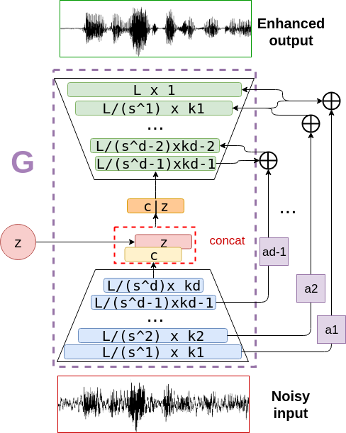

# Konuşma Geliştiren GAN
# Konuşma Geliştiren Üreten Düşman Ağı
# SEGAN
# SE-GAN
# Speech Enhancement GAN
# Speech Enhancement Generative Adversarial Network

### Önceden eğitilmiş model.
Eski SEGAN üretecinin weight değerleri buradaki link üzerinden ulaşılabilir. [this link](http://veu.talp.cat/seganp/release_weights/segan+_generator.ckpt)
`ckpt_segan` ve `train.opts`(ayar dosyası) dosyalarının çalıştığınız dizinde olduğundan emin olun. 
`run_segan_clean.sh` komutu ayar dosyasında yazdığı gibi yorumlanacaktır.

### Eski SEGAN tanıtımı
Eski SEGAN ağı verinin eğitim sırasında karışmasını önlemek üzere daraltıcı ve genişletici arasında kaçış bağlantıları kullanır. 
WaveGAN ile gürültü azaltma uygularken görülen problemdir. Kaldı ki WaveGAN bu amaç için tasarlanmamıştır. Loss fonksiyonu LSGAN'dir.


### Yeni SEGAN tanıtımı
Yeni SEGAN ağı eski SEGAN ağının üzerine geliştirilmiş bir versiyondur [1]. Daraltıcı ve genişletici arasında kaçış bağlantıları kullanır 
fakat genişleticinin üst katmanlarına doğru giden kaçış katmanları bulunur. Kaçış katmanlarını birleştirmke üzere iki yöntem vardır.
#####['toplama(summation)' and 'yan yana veya üst üste ekleme(concatenate)']
Daraltıcı ve genişletici kaçış bağlantıları genişleticinin üst katmanına birleşir ve bağlanır.

Loss fonksiyonu LSGAN'dir. Loss fonksiyonları kaçış bağlantıları değiştiğinde değişmez.




### Komut dosyalarının tanıtımı
Konuşma iyileştirme yapmak üzere eğitmeye hazır wav2wav üç model vardır.
Generator ağıyla (G) gürültü elemeye başlamak üzere şuradaki komut kullanılabilir. Komut çalışmıyorsa dosya düzeninize ve dosya yolunuza dikkat edin.<br/>
<b>Not: Batch boyutunu hafızanızın boyutuna göre belirleyin.</b>

```
python train.py --save_path ckpt_segan+ --batch_size 300 \
		--clean_trainset data/clean_trainset \
		--noisy_trainset data/noisy_trainset \
		--cache_dir data/cache
```

Daha fazla bilgi için `run_new_segan_train.sh` komut dosyasını okuyabilirsiniz.

G ve D ağları varsayılan şekilde eğitime başlayacaktır. Fakat eklediğim bir çok ayar değiştirilerek iyileştirilebilir.
Örneğin, `--d_pretrained_ckpt` ve/veya `--g_pretrained_ckpt` ayarlarıyla önceden oluşturulmuş kontrol noktaları ile oynayarak bazı iyileştirmeler yapılabilir. Misal dil iyileştirmesi [2]. 
For example, one can play with `--d_pretrained_ckpt` and/or `--g_pretrained_ckpt` to specify a departure pre-train checkpoint to fine-tune some characteristics of our enhancement system, like language, as in [2].

Ses temizleme işlemi eğitim sırasında çıkan generator'ün kontrol noktasıyla ve karşılık gelen ayar dosyasıyla yapılabilir. (wav okumak için `soundfile` seçeneği tavsiye ederim. `--soundfile` ile kullanılabilir.)

```
python clean.py --g_pretrained_ckpt ckpt_segan+/<weights_ckpt_for_G> \
		--cfg_file ckpt_segan+/train.opts --synthesis_path enhanced_results \
		--test_files data/noisy_testset --soundfile
```

Daha fazla bilgi için `run_new_segan_clean.sh` komut dosyasını okuyabilirsiniz.

WSEGAN ağı, SEGAN'a ek olarak ıslık gürültüsünü azaltmayı amaçlar [3].
Bu sistem `--wsegan` seçeneğiyle aktive edilir(vanilla GAN dışında).
Ek olarak, `--misalign_pair` ile sonucu iyileştirmek üzere veri seti bilerek bozulur(augmentation) [3].

AEWSEGAN ağı, discriminator ağını devre dışı bırakarak eğitimi hızlandırmayı ve daha hafif, az kaynak harcayan bir çözüm elde etmeyi amaçlar.
Bu sistem `--aewsegan` seçeneğiyle aktive edilir(vanilla GAN dışında).
Ek olarak, `--misalign_pair` ile sonucu iyileştirmek üzere veri seti bilerek bozulur(augmentation) [3].

### Referanslar:
1. [SEGAN: Speech Enhancement Generative Adversarial Network (Pascual et al. 2017)](https://arxiv.org/abs/1703.09452)
2. [Language and Noise Transfer in Speech Enhancement GAN (Pascual et al. 2018)](https://arxiv.org/abs/1712.06340)
3. [Whispered-to-voiced Alaryngeal Speech Conversion with GANs (Pascual et al. 2018)](https://arxiv.org/abs/1808.10687)
4. [SEGAN linkedin slayt](https://www.slideshare.net/xavigiro/segan-speech-enhancement-generative-adversarial-network?from_action=save)
5. [Dataset](https://datashare.is.ed.ac.uk/handle/10283/1942)

### Alıntı
Teşekkürler:
```
@article{pascual2017segan,
  title={SEGAN: Speech Enhancement Generative Adversarial Network},
  author={Pascual, Santiago and Bonafonte, Antonio and Serr{\`a}, Joan},
  journal={arXiv preprint arXiv:1703.09452},
  year={2017}
}
```

```
Jetbrainse teşekkür ederim. Araştırmamı yaparken açık kaynak için bedava lisans sağladı.
Çok memnun oldum.
```

### Notlar
* Birden fazla kaynağı aldım, birleştirdim ve kendi ihtiyaçlarıma göre değiştirdim. Makale yazarlarına teşekkür ederim.
* Tam anlamıyla benzer bir dal değildir. Çok değişiklik yaptım.
* Derin öğrenme için kullanılan ana framework Pytorch'tur.
* !!! Sık güncelleme olmayacaktır. !!!
<br/><br/>
* Sincconv ve diğer bazı genelleştirilmiş cos pencereleme teknikleri yazılama eklendi.<br/>
Not: Bir yapay sinir ağı içinde çok fazla sincconv katmanı kullanmayın. Sinc fonksiyonunun doğasından dolayı eğitimin yarıda kesilmesine sebep olabilir.
* Tensorboard Pytorch.utils sınıfıyla yazılma eklendi. 
<br/><br/>
* Tek iterasyon içinde birden fazla discriminator iterasyonu denedim. Tüm mimarilerde discriminator overfitting problemini yaşadım ve generator her iterasyonda daha kötüye gitti.
* * Tek iterasyon içinde birden fazla dinamik(diğer adıyla şartlı) discriminator parametre güncellemesi denedim. 
Sonuç olarak sebebini açıklayamadığım şekilde generator loss artış gösterdi ve eğitim yavaşladı.
* * Önceden derlenmiş olsa bilr eğitimin her iterasyonda yavaşladığını gördüm. 
* Bazı Pytorch-Jıt özellikleri yazılıma eklendi. Bu sayede eğitimin her iterasyonda yavaşça hızlandığını gördüm.  
* Dağınık hesaplamanın yüksek kaynak kullanımasından ötürü çoklu GPU ile eğitme özelliğini tamamen yazılıma ekleyemedim.
* Eski SEGAN mimarisinin kaynak kodlarında Virtual Batch Norm bulunmuyordu. Eğer sıradan Batch Norm kullanılırsa sadece D için benzer sonuçlar alınabilir. (yazılıma eklendi)
<br/><br/>
* Kaynak kodlardaki karışıklık veya gelecekte olabilecek değişiklerle ilgili herhangi bir güvence ve asistanlık vermiyorum.
* Sağladığım kaynak kodlar için herhangi bir sorumluluk almıyorum..
<br/><br/>
* Bazı kullanılmamış sınıflar vardır. Fikirlerimi test etmek üzere kullanıyorum.

### Gelecek Planları
* Loss fonksiyonunu wasserstein loss olarak değiştirmek Yeni segan least square loss kullanıyor.
* Daraltıcı kısma kaçış bağlantıları eklemek.
* Discriminatordan daha iyi geri dönüşler almak. Discriminator sadece 0(sahte) ve 1(gerçek) değerlerini veriyor. 
Bool olmayan geri dönüş almak istiyorum. Bu bütün GAN ağlarını dramatik biçimde geliştirecektir.
* Self-attention daha yazılıma eklenmedi. (henüz)
* Octave convolution daha yazılıma eklenmedi. (henüz)


<br/><br/><br/><br/>
Not: Türkçe versiyon İngilizce versiyonun bire bir çevirisi değildir. Çünkü Türkçede bazı şeyler farklı şekilde daha iyi açıklanabiliyor. 